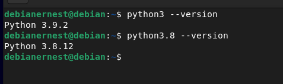

#   Bank web page automation using voice input and intent detection.

##  The intention and state of the project.

-   Intention
    
        The objective of this project is to make the website of the bank Credit Andorra more easily accessible to accessibility challenged users. The project manly centers around conversational accessibility, so the users that would benefit the most form it would be: visually impaired users, elderly users or any type of users that have difficulty navigating the banks website, but is capable of maintaining a conversation. 

        This project basically allows users to maintain a conversation with an AI that will perform the desired actions in the context of the bank’s functionalities.
-   State

        Currently the project is just a probe of concept demo, it is a bit complicated to launch and set up, so don’t feel discouraged if you encounter roadblock when launching it.

        It is currently only capable of preforming 3 action: make a bank transfer, check account charges and schedule sequential transfers.

        When the AI triggers an action, it currently launches a browser instance and controls the website of the bank by using the selenium driver. This is due to the fact that the bank does not currently have a public API available. The double factor of authentication also needs to be circumvented; this is done by resending the received text messages from the phone to an email address. And then extracting the received message to use it in the site. This will hopefully all change when the bank make a public API available.

##      Structure

The project is mostly divided into two directories, bankFunctions where we have have all the code relating to our bank operations and RasaProject where we have the conversational AI that we developed.

**BankFunctions**

-    andBank

        Directory containing AndBank operations.
        Currently we have a script to extract the phone confirmation message and another that interacts with web elements to login to the bank page.

-    apiFunctions

        -   templates
        
        We currently have two html pages, one to create credentials and store them and another to preform a bankTransfer and checking totals 

        The first one is the **index** html and the other one is at **Checktotals** endpoint.

        -   apiEndpoints

        This is a simple endpoint declaration file that allows you to access our created functionalities from a remote machine, this file also serves our HTML templates.

-    Credit

        **confirmatonCodeCredit**

        In this file we have the extraction script for the confirmation code message for the session start, and the confirmation code for the bank transfer, these messages don’t have the same formatting.

        **coordenatesFlow**

        This was the flow that was being utilized to automate the coordinate card filling, but since this project started the bank has eliminated this functionality. 
        This is no longer in operation. 

        **downloadExpenses**

        this flow controls the bank website to download the account totals.

        **loginAndNavegateCredit**

        This flow preforms a session login in the bank website 

        **makeTransfer**

        This flow controls the bank website to perform a bank transfer

        -    emailFunctionalties

        This script utilizes the imap protocol to extract the las received email message, that being the last IFTTT confirmation messager set to the phone as a text message.

        -    encryptionFunctionalties

                **encryptFileUsingKey**

                This script encrypts the entered credentials using an encryption key and then destroys the original unencrypted file.

                The file structure needs to be the following 
                
                `{“fileName”:” encrypted file name”, “key”:“key file Name”, “user”:“userName”, “pass”: “password”, “email”: “email”, “emailpass”: “email Passowrd”}`

                **encryptionKeyGeneration**

                It generates an encryption key

                **generateKeyAndUseIT**

                it utilizes the two previous scripts in sequence.

                **readEncryptedFileModulus**

                It unencrypts an encrypted file utilizing the entered key and then it returns the information in a JSON format

        -   rasaConnections

        **catalaConnectionText**

        it allows the user to send a message via voice, the ai processes it and responds with a text message.

        **catalaConnectionVoiceResonse**

        it allows the user to send a message via voice, the ai processes it and responds with a voice message.

        **terminalTriggers**

        This is the connection with the syntactic interpreter but only via text

**RasaProject**

-   actions

This is currently not in use, but it can be used to execute custom python functions in the context of the interpreter. 

-   Data

**nlu** This is the declarative document that is being used to train our neuronal network, it is composed of a sequence of typified examples. These types will allow our neuronal network to classify the user inputs as user intents based on typification.

**stories** This document is made to guide the program in a conversation.To sum-up it will tell the program how to respond to user intents and it will also guide responses based on conversation variations. 

**rules** this is a declarative file to skip defined storylines in the stories file.
this file will allow for automatic response of questions effectively skipping defined stories. It is important to understand that if it is abused it will have a negative impact on the program’s effectiveness

-   models

This is where the neuronal network trained models are stored.

-   test

this a test stories to test the neuronal network operation.

-   The other files in the directory

**config** This is the file that allows for program configurations, right now it configured to interact with a duckling instance that is running locally in a docker container.

**credentials** right now it’s only being used to declare the endpoint to connect to the neuronal network, but it can be used to verify user connections and establish secure connections with them.

**domain** it is a file that is used to declare memory entity slots (this so that the program can remember conversation specific details)
it is also used to declare available answers.

**endpoints** this is used to declare other types of connections, but it is not being used right now.

##      Installation

-  Required software

[Python, (versions 3.9 and version 3.8)](https://www.python.org/downloads/)

[Flask](https://flask.palletsprojects.com/en/2.1.x/installation/)

[docker](https://www.docker.com/)

[pyaudio](https://pypi.org/project/PyAudio/)

[selenium](https://selenium-python.readthedocs.io/)

[rasa](https://rasa.com/docs/rasa/installation/)

A Linux operating system is recommended

###     Guide

     a Debian operating system will be assumed

1.	**Install the geckodriver**

     Download the latest geckodriver release in the following link [geckodriverReleases](https://github.com/mozilla/geckodriver/releases)
(The 64bit driver is recommended)
Extract the driver using the following command 
`tar -xf geckodriver-v0.30.0-linux64.tar.gz`
Move the driver to the correct directory using the following command 
`mv geckodriver /usr/bin/`

2.    **Install the python selenium library**

        `sudo pip install selenium`

3.    **Add project location permanently to the python path**

        Edit the `~/.bashrc` file and add the following line
        `export PYTHONPATH="${PYTHONPATH}:/path/that/you/want"`

4.    **Separate your local python installation**

        This can be done many ways, but essentially you want to end up with something like this. 

5.    **Create a virtual environment for the two python**

        `python3 -m venv /path/to/new/virtual/environment`

        `python3.8 -m venv /path/to/new/virtual/environment2`

6.    **Install pyaudio**

        This can be complex and depends on the machine. But I’ll list some commands that worked for me 

        `sudo apt-get install libasound-dev`

        download pyaudio archive: http://files.portaudio.com/download.html

        unzip the archive `tar -zxvf [portaudio.tgz]`
        enter the uncompressed directory and run the following command 

        `./configure && make`
        When it’s done installing continue with the following commands 

        `sudo make install`

        `sudo pip install pyaudio`

        `sudo apt-get install python3 python3-all-dev python3-pip build-essential swig git libpulse-dev`

7.    **Install rasa**

        `Enter the 3.8 python virtual environment 
        And install rasa use the following commands 

        `source ./venv/bin/activate`

        `pip3 install -U --user pip && pip3 install rasa`

8.    **Install the rest of library dependencies**

9.    **The flask dependency needs to be installed in the python 3.9 version**

10. **Install IFTTT in your phone and download my automation, from user automations user ernestmolner18@gmail.com**

11.    **Install docker and download the duckling container curated for rasa**

        https://docs.docker.com/get-docker/

        https://hub.docker.com/r/rasa/duckling

###    Startup instructions 

1.	Enter each of the python virtual environments Using `source ./venv/bin/activate`

2.	Run the docker container with the duckling instance `docker run  -p 8000:8000 rasa/duckling`

3.	In the python 3.8 virtual environment 
Enter the rasaProject directory and enter the command `rasa run`

4.	To run the voice assistant program, enter the path
`\bankFunctions\rasaConnections\`  and run the `catalaConnectionVoiceResonse.py` file

5.	To start the web server 
In the python 3.9 virtual environment and run flask

     `flask run` command

